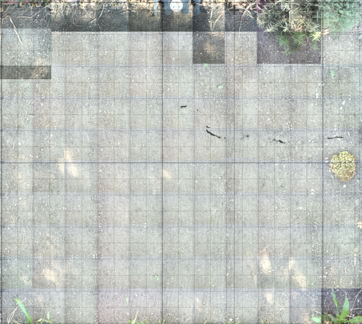
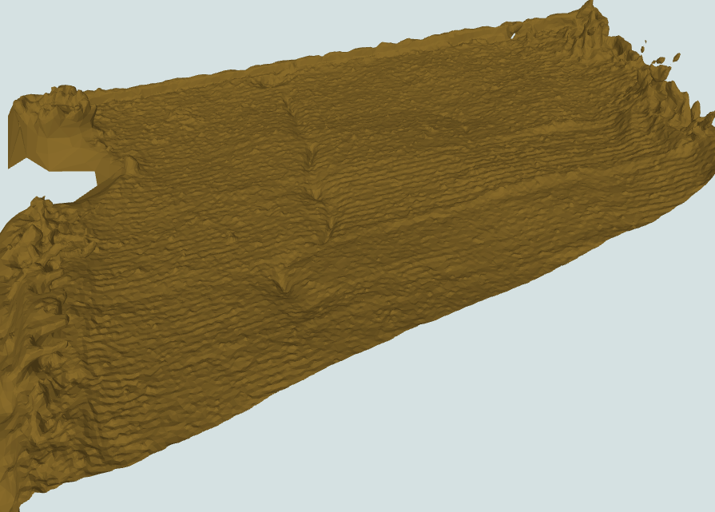
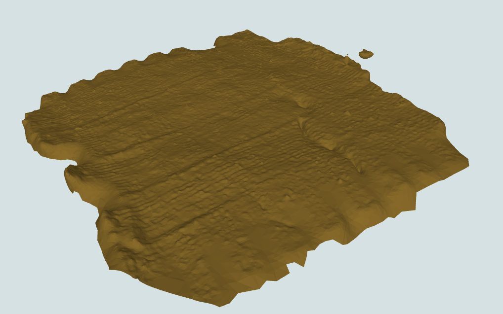

# FarmBot Garden Images

---

This is a collection of images of a 2000x2100mm FarmBot after a harvest.

It is intended to simulate a garden in its "mostly empty" state.

Each photo is labeled by its X,Y coordinates in the format of `images/x.y.jpg`. **All photos were taken at a gantry height of Z=0.**

For example, the photo of (50,50) is shown in `images/50.50.jpg`.

# Camera Calibration Data

Below is a table listing the calibration for the camera that was used to take the photos.

| Name | Value |
|--|--|
|Camera offset X|50|
|Camera offset Y|100|
|Origin location|Top right|
|Pixel coordinate scale|0.555|
|Camera rotation|83.23|
