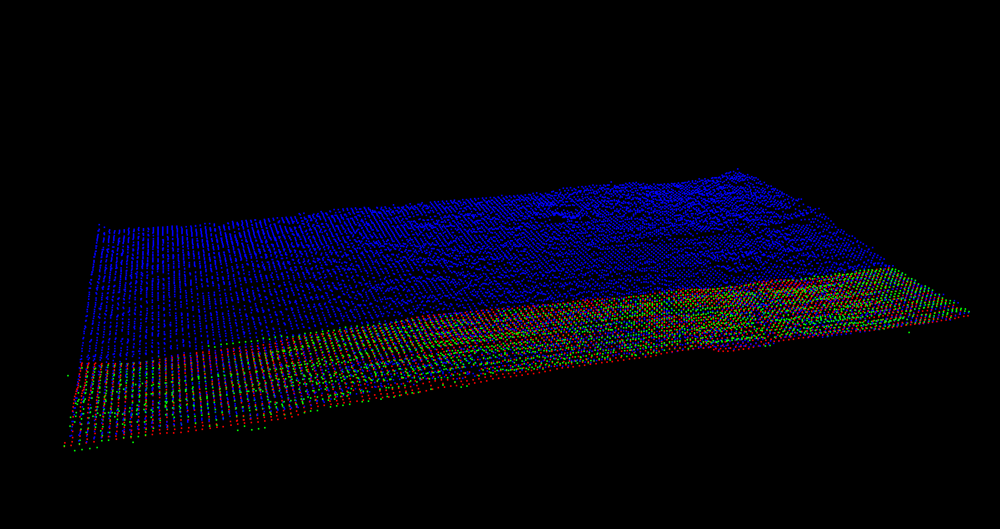
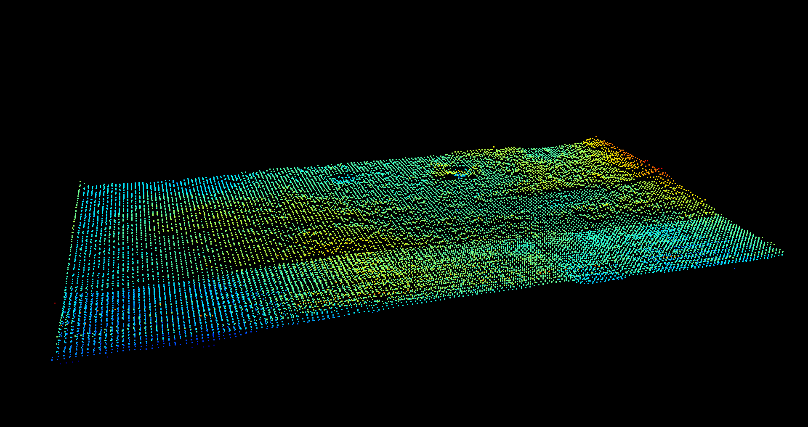
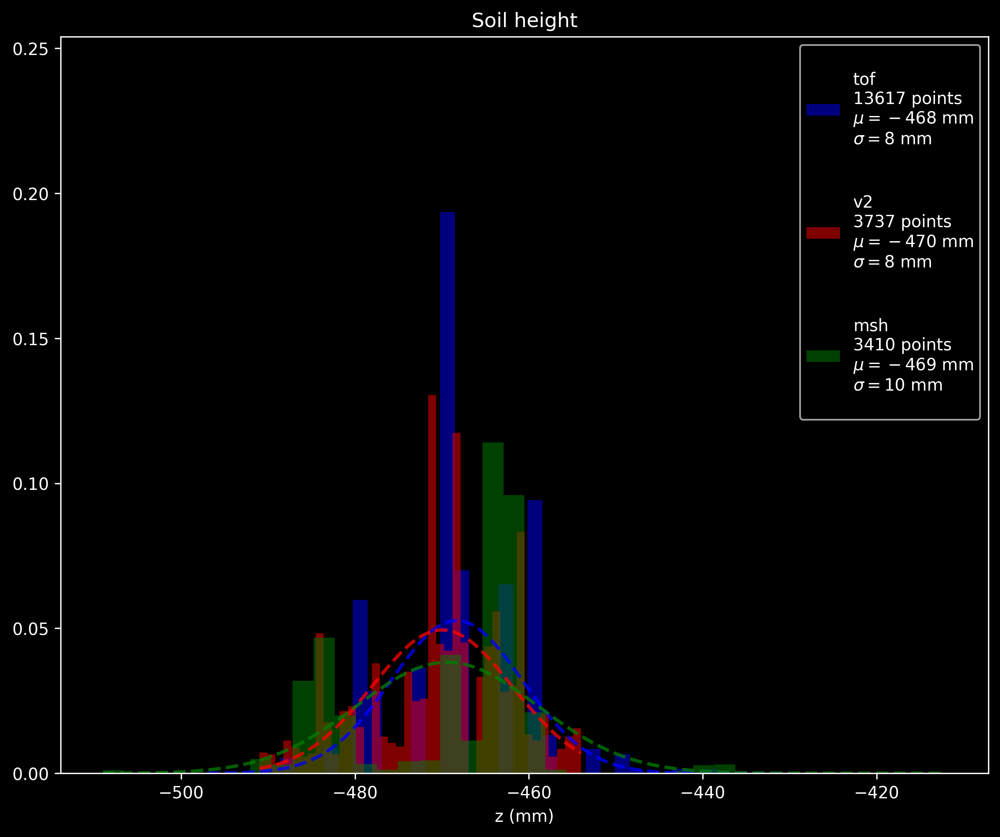

# 3D comparison of different soil height surface measurement methods

## Contents

Results from the data in this repository.

| filename   | n   | visualization color | z adjustment | description
|------------|-----|---------------------|--------------|------------
|`tof.xyzrgb`|13617| blue                |    -20mm     |time of flight single point ranging LiDAR sensor values
|`v2.xyzrgb` | 3737| red                 |              |[v2 dataset z coordinates](https://github.com/FarmBot-Labs/garden-surface-data/releases/tag/v2)
|`msh.xyzrgb`| 3410| green               |              |[Measure Soil Height](https://github.com/FarmBot-Labs/measure-soil-height) chosen surface heights using v2 dataset

## Setup
```
python3 -m pip install open3d
```

## Run
```
python3 viewer.py
```

Press `h` with the viewer open to print a list of keyboard controls to the terminal.


Some useful controls:
 - Click and drag to rotate.
 - Use `1` and `4` on keyboard to switch between file and z-based color views.
 - Use `[` and `]` to change perspective.
 - Use `+` and `-` to change voxel size.


Additional controls:
 - `F`: front view
 - `G`: side view
 - `U`: top view






